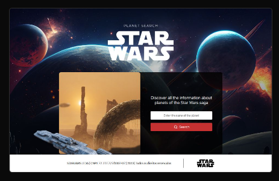

## Link Vercel Star Wars Planet Search Project

[Demo](https://star-wars-planet-search-seven.vercel.app/)



## Rodar o Projeto Star Wars Planet Search Project

First, install dependencies:

```bash
yarn
```

Run the development server:

```bash
yarn dev
```

Open [http://localhost:3000](http://localhost:3000) with your browser to see the result.

## Tecnologias Utilizadas

- NextJS
- React
- Axios
- Eslint
- Lint-staged
- Typescript
- Editorconfig
- Prettier
- Styled-components
